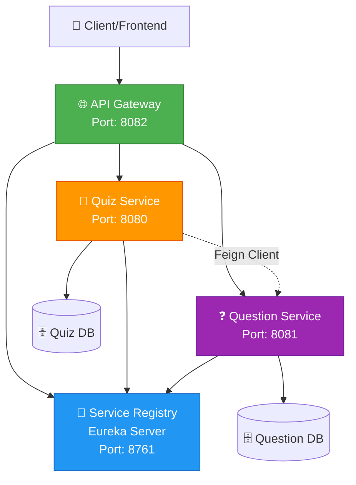
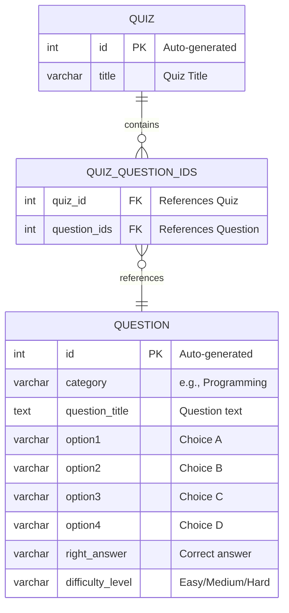

<div align="center">

# 🎯 Microservices Quiz Application

### *Build. Quiz. Scale.*

[](https://www.oracle.com/java/)
[](https://spring.io/projects/spring-boot)
[](https://microservices.io/)
[](https://www.mysql.com/)
[](LICENSE)

**A production-ready, scalable quiz platform built with Spring Boot Microservices** 🚀

[Features](#-features) •
[Architecture](#-architecture) •
[Getting Started](#-getting-started) •
[Database Schema](#-database-schema--erd) •
[API Docs](#-api-documentation) •
[Contributing](#-contributing)

---

</div>

## 📖 Table of Contents

- [🌟 Overview](#-overview)
- [🏗️ Architecture](#️-architecture)
- [🛠️ Services](#️-services)
- [✨ Features](#-features)
- [💻 Tech Stack](#-tech-stack)
- [🚀 Getting Started](#-getting-started)
- [🗄️ Database Schema & ERD](#️-database-schema--erd)
- [📚 API Documentation](#-api-documentation)
- [🧪 Testing](#-testing)
- [📁 Project Structure](#-project-structure)
- [🤝 Contributing](#-contributing)
- [📄 License](#-license)
- [👨‍💻 Contact](#-contact)

---

## 🌟 Overview

The **Microservices Quiz Application** is a fully distributed, cloud-ready system designed to manage quizzes and questions at scale. Built following **microservices design patterns** and **best practices**, it demonstrates enterprise-level architecture:

🔹 **Service Discovery** using Netflix Eureka  
🔹 **API Gateway** for unified client entry point  
🔹 **Inter-service Communication** via OpenFeign  
🔹 **RESTful APIs** with comprehensive Swagger documentation  
🔹 **Database per Service** pattern for data isolation  
🔹 **Horizontal Scalability** for production environments

> **Perfect for learning microservices or building production quiz systems!**

---

## 🏗️ Architecture

<div align="center">



</div>

### 🎨 Architecture Principles

| Principle | Description |
|-----------|-------------|
| 🔐 **Decentralized Data** | Each service owns its database |
| 🔍 **Service Discovery** | Eureka enables dynamic service registration |
| 🚪 **API Gateway Pattern** | Single entry point for all requests |
| 💪 **Resilience** | Services scale independently |
| 🔗 **Loose Coupling** | Services communicate via REST APIs |

---

## 🛠️ Services

<table>
<tr>
<td width="25%">

### 1️⃣ 📡 Service Registry

**Technology**: Netflix Eureka

**Port**: `8761`

🔹 Service registration  
🔹 Health monitoring  
🔹 Load balancing support  
🔹 Dynamic discovery

</td>
<td width="25%">

### 2️⃣ 🌐 API Gateway

**Technology**: Spring Cloud Gateway

**Port**: `8082`

🔹 Request routing  
🔹 CORS handling  
🔹 Authentication layer  
🔹 Load distribution

</td>
<td width="25%">

### 3️⃣ ❓ Question Service

**Domain**: Question Management

**Port**: `8081`

🔹 CRUD operations  
🔹 Category filtering  
🔹 Random generation  
🔹 Scoring logic

</td>
<td width="25%">

### 4️⃣ 🎯 Quiz Service

**Domain**: Quiz Management

**Port**: `8080`

🔹 Quiz creation  
🔹 Question linking  
🔹 Submission handling  
🔹 Score calculation

</td>
</tr>
</table>

---

## ✨ Features

<div align="center">

### 🎮 Core Functionality

</div>

| Feature | Description | Icon |
|---------|-------------|------|
| **Dynamic Quiz Creation** | Generate quizzes from question bank by category | 🎲 |
| **Question Bank** | Comprehensive CRUD for questions | 📝 |
| **Auto-Grading** | Real-time quiz evaluation and scoring | ✅ |
| **Category System** | Organize questions by topics | 📂 |
| **Difficulty Levels** | Support for Easy, Medium, Hard | 📊 |
| **Service Discovery** | Auto-registration with Eureka | 🔍 |
| **API Documentation** | Interactive Swagger UI | 📖 |
| **Horizontal Scaling** | Deploy multiple instances | 🚀 |

<div align="center">

### 🔧 Technical Features

</div>

- 🔄 **Feign Client** - Declarative REST client for inter-service calls
- 🗄️ **JPA/Hibernate** - Database abstraction and ORM
- 🔍 **Service Registry** - Dynamic service location
- 🌐 **API Gateway** - Centralized routing and filtering
- 📊 **H2/MySQL/PostgreSQL** - Flexible database support
- 🛡️ **Error Handling** - Comprehensive exception management
- 📈 **Metrics Ready** - Integration with Spring Boot Actuator

---

## 💻 Tech Stack

<div align="center">

### Backend Technologies

[](https://www.oracle.com/java/)
[](https://spring.io/projects/spring-boot)
[](https://spring.io/projects/spring-cloud)
[](https://hibernate.org/)

### Microservices Stack

[](https://cloud.spring.io/spring-cloud-netflix/)
[](https://spring.io/projects/spring-cloud-gateway)
[](https://spring.io/projects/spring-cloud-openfeign)

### Database & Tools

[](https://www.mysql.com/)
[](https://www.h2database.com/)
[](https://maven.apache.org/)
[](https://swagger.io/)

</div>

---

## 🚀 Getting Started

### 📋 Prerequisites

Before you begin, ensure you have the following installed:

- ☕ **Java 17+** - [Download](https://www.oracle.com/java/technologies/downloads/)
- 📦 **Maven 3.8+** - [Download](https://maven.apache.org/download.cgi)
- 💾 **MySQL 8.0+** (Optional) - [Download](https://dev.mysql.com/downloads/)
- 🛠️ **IDE** - IntelliJ IDEA / Eclipse / VS Code
- 🔧 **Git** - [Download](https://git-scm.com/downloads)

---

### 📥 Installation

#### **Step 1: Clone the Repository**

```bash
git clone https://github.com/BasharatHaider246/microservices-quiz-app.git
cd microservices-quiz-app
```

#### **Step 2: Configure Databases**

Each service has its own `application.properties` in `src/main/resources/`.

**For MySQL (Production):**

```properties
# Question Service - application.properties
spring.datasource.url=jdbc:mysql://localhost:3306/question_db
spring.datasource.username=root
spring.datasource.password=yourpassword
spring.jpa.hibernate.ddl-auto=update
spring.jpa.show-sql=true

# Quiz Service - application.properties
spring.datasource.url=jdbc:mysql://localhost:3306/quiz_db
spring.datasource.username=root
spring.datasource.password=yourpassword
spring.jpa.hibernate.ddl-auto=update
```

**For H2 (Development/Testing):**

```properties
spring.datasource.url=jdbc:h2:mem:testdb
spring.datasource.driver-class-name=org.h2.Driver
spring.h2.console.enabled=true
```

---

### ▶️ Running the Application

**⚠️ Important: Start services in this exact order!**

#### **1️⃣ Start Service Registry (Eureka Server)**

```bash
cd service-registry
mvn clean install
mvn spring-boot:run
```

✅ **Verify**: Open `http://localhost:8761` - Eureka Dashboard should be visible

---

#### **2️⃣ Start Question Service**

```bash
cd question-service
mvn clean install
mvn spring-boot:run
```

✅ **Verify**: Check Eureka Dashboard - `QUESTION-SERVICE` should appear

---

#### **3️⃣ Start Quiz Service**

```bash
cd quiz-service
mvn clean install
mvn spring-boot:run
```

✅ **Verify**: Check Eureka Dashboard - `QUIZ-SERVICE` should appear

---

#### **4️⃣ Start API Gateway**

```bash
cd api-gateway
mvn clean install
mvn spring-boot:run
```

✅ **Verify**: Gateway is routing requests

---

### 🎉 Access the Application

| Service | URL | Description |
|---------|-----|-------------|
| 📡 **Eureka Dashboard** | `http://localhost:8761` | Service registry interface |
| ❓ **Question Service** | `http://localhost:8081/swagger-ui.html` | Question API docs |
| 🎯 **Quiz Service** | `http://localhost:8080/swagger-ui.html` | Quiz API docs |
| 🌐 **API Gateway** | `http://localhost:8082` | Unified API entry point |

---

## 🗄️ Database Schema & ERD

### 📊 Entity Relationship Diagram

<div align="center">



</div>

---

### 🎯 Database Architecture

**Two Separate Databases (Microservices Pattern):**

<table>
<tr>
<td width="50%">

### 🎯 Quiz Database
**Managed by**: Quiz Service  
**Port**: 8080

**Tables:**
- ✅ `quiz`
- ✅ `quiz_question_ids` (junction table)

</td>
<td width="50%">

### ❓ Question Database
**Managed by**: Question Service  
**Port**: 8081

**Tables:**
- ✅ `question`

</td>
</tr>
</table>

> 💡 **Note**: Each service has its own isolated database following the **Database per Service** pattern for true microservices independence.

---

### 📋 Detailed Table Schemas

<details>
<summary><b>📊 QUESTION Table Schema</b> (Click to expand)</summary>

| Column | Type | Constraints | Description | Example |
|--------|------|-------------|-------------|---------|
| `id` | `INTEGER` | `PRIMARY KEY`<br>`AUTO_INCREMENT` | Unique question identifier | `1, 2, 3...` |
| `category` | `VARCHAR(255)` | `NOT NULL` | Question category/topic | `Programming`, `Science` |
| `question_title` | `TEXT` | `NOT NULL` | The actual question text | `What is JVM?` |
| `option1` | `VARCHAR(255)` | `NOT NULL` | First answer option (A) | `Java Virtual Machine` |
| `option2` | `VARCHAR(255)` | `NOT NULL` | Second answer option (B) | `Java Vendor Machine` |
| `option3` | `VARCHAR(255)` | `NOT NULL` | Third answer option (C) | `Java Versatile Method` |
| `option4` | `VARCHAR(255)` | `NOT NULL` | Fourth answer option (D) | `Joint Venture Model` |
| `right_answer` | `VARCHAR(255)` | `NOT NULL` | The correct answer | `Java Virtual Machine` |
| `difficulty_level` | `VARCHAR(50)` | `NOT NULL` | Question difficulty | `Easy`, `Medium`, `Hard` |

**SQL CREATE Statement:**

```sql
CREATE TABLE question (
    id INT AUTO_INCREMENT PRIMARY KEY,
    category VARCHAR(255) NOT NULL,
    question_title TEXT NOT NULL,
    option1 VARCHAR(255) NOT NULL,
    option2 VARCHAR(255) NOT NULL,
    option3 VARCHAR(255) NOT NULL,
    option4 VARCHAR(255) NOT NULL,
    right_answer VARCHAR(255) NOT NULL,
    difficulty_level VARCHAR(50) NOT NULL,
    INDEX idx_category (category),
    INDEX idx_difficulty (difficulty_level)
);
```

**Sample Data:**

```sql
INSERT INTO question VALUES 
(1, 'Programming', 'What is JVM?', 'Java Virtual Machine', 'Java Vendor Machine', 
 'Java Versatile Method', 'Joint Venture Model', 'Java Virtual Machine', 'Easy');
```

</details>

---

<details>
<summary><b>🎯 QUIZ Table Schema</b> (Click to expand)</summary>

| Column | Type | Constraints | Description | Example |
|--------|------|-------------|-------------|---------|
| `id` | `INTEGER` | `PRIMARY KEY`<br>`AUTO_INCREMENT` | Unique quiz identifier | `1, 2, 3...` |
| `title` | `VARCHAR(255)` | `NOT NULL` | Name/title of the quiz | `Java Basics Quiz` |

**SQL CREATE Statement:**

```sql
CREATE TABLE quiz (
    id INT AUTO_INCREMENT PRIMARY KEY,
    title VARCHAR(255) NOT NULL,
    INDEX idx_title (title)
);
```

**Sample Data:**

```sql
INSERT INTO quiz VALUES (1, 'Java Basics Quiz');
INSERT INTO quiz VALUES (2, 'Python Fundamentals');
```

</details>

---

<details>
<summary><b>🔗 QUIZ_QUESTION_IDS Junction Table Schema</b> (Click to expand)</summary>

| Column | Type | Constraints | Description | Example |
|--------|------|-------------|-------------|---------|
| `quiz_id` | `INTEGER` | `FOREIGN KEY`<br>References `quiz(id)` | Links to parent quiz | `1, 2, 3...` |
| `question_ids` | `INTEGER` | `FOREIGN KEY`<br>References `question(id)` | Links to question | `10, 15, 23...` |

**Composite Primary Key:** (`quiz_id`, `question_ids`)

**SQL CREATE Statement:**

```sql
CREATE TABLE quiz_question_ids (
    quiz_id INT NOT NULL,
    question_ids INT NOT NULL,
    PRIMARY KEY (quiz_id, question_ids),
    FOREIGN KEY (quiz_id) REFERENCES quiz(id) ON DELETE CASCADE,
    FOREIGN KEY (question_ids) REFERENCES question(id) ON DELETE CASCADE,
    INDEX idx_quiz (quiz_id),
    INDEX idx_question (question_ids)
);
```

**Sample Data:**

```sql
-- Quiz 1 contains questions 1, 2, 3, 4, 5
INSERT INTO quiz_question_ids VALUES (1, 1);
INSERT INTO quiz_question_ids VALUES (1, 2);
INSERT INTO quiz_question_ids VALUES (1, 3);
INSERT INTO quiz_question_ids VALUES (1, 4);
INSERT INTO quiz_question_ids VALUES (1, 5);
```

</details>

---

### 🔑 Key Database Relationships

| Relationship | Type | Description |
|--------------|------|-------------|
| Quiz → Quiz_Question_IDs | **One-to-Many** | One quiz contains many question mappings |
| Question → Quiz_Question_IDs | **One-to-Many** | One question can be in multiple quizzes |
| Quiz ↔ Question | **Many-to-Many** | Implemented via junction table |

---

## 📚 API Documentation

### 🔍 Swagger UI

Each service exposes **interactive API documentation**:

- 📘 **Question Service Swagger**: `http://localhost:8081/swagger-ui.html`
- 📗 **Quiz Service Swagger**: `http://localhost:8080/swagger-ui.html`

---

### 📡 API Endpoints

<details>
<summary><b>❓ Question Service Endpoints</b></summary>

| Method | Endpoint | Description | Status |
|--------|----------|-------------|--------|
| `GET` | `/question/allQuestions` | Get all questions | ✅ |
| `GET` | `/question/category/{category}` | Get questions by category | ✅ |
| `POST` | `/question/add` | Add new question | ✅ |
| `GET` | `/question/generate` | Generate random questions | ✅ |
| `POST` | `/question/getQuestions` | Get questions by IDs | ✅ |
| `POST` | `/question/getScore` | Calculate score | ✅ |
| `DELETE` | `/question/delete/{id}` | Delete question | ✅ |

</details>

<details>
<summary><b>🎯 Quiz Service Endpoints</b></summary>

| Method | Endpoint | Description | Status |
|--------|----------|-------------|--------|
| `POST` | `/quiz/create` | Create new quiz | ✅ |
| `GET` | `/quiz/get/{id}` | Get quiz questions | ✅ |
| `POST` | `/quiz/submit/{id}` | Submit quiz answers | ✅ |

</details>

---

### 💡 Example API Calls

#### 📝 Create a Question

```bash
POST http://localhost:8081/question/add
Content-Type: application/json

{
  "category": "Programming",
  "questionTitle": "What does JVM stand for?",
  "option1": "Java Virtual Machine",
  "option2": "Java Vendor Machine",
  "option3": "Java Versatile Method",
  "option4": "Java Variable Manager",
  "rightAnswer": "Java Virtual Machine",
  "difficultyLevel": "Easy"
}
```

---

#### 🎯 Create a Quiz

```bash
POST http://localhost:8080/quiz/create
Content-Type: application/json

{
  "categoryName": "Programming",
  "numQuestions": 5,
  "title": "Java Basics Quiz"
}
```

---

#### 🎮 Get Quiz Questions

```bash
GET http://localhost:8080/quiz/get/1
```

---

#### ✅ Submit Quiz Answers

```bash
POST http://localhost:8080/quiz/submit/1
Content-Type: application/json

[
  { "id": 1, "response": "Java Virtual Machine" },
  { "id": 2, "response": "int i;" }
]
```

---

## 🧪 Testing

Run unit and integration tests:

```bash
# Test Question Service
cd question-service
mvn test

# Test Quiz Service
cd quiz-service
mvn test

# Test all services
mvn clean test
```

---

## 📁 Project Structure

```
microservices-quiz-app/
│
├── 📡 service-registry/          # Netflix Eureka Server
│   ├── src/
│   │   ├── main/
│   │   │   ├── java/
│   │   │   └── resources/
│   │   └── test/
│   └── pom.xml
│
├── 🌐 api-gateway/               # Spring Cloud Gateway
│   ├── src/
│   │   ├── main/
│   │   └── test/
│   └── pom.xml
│
├── ❓ question-service/          # Question Management Service
│   ├── src/
│   │   ├── main/
│   │   │   ├── java/
│   │   │   │   ├── controller/
│   │   │   │   ├── service/
│   │   │   │   ├── dao/
│   │   │   │   └── model/
│   │   │   └── resources/
│   │   │       ├── application.properties
│   │   │       └── data.sql
│   │   └── test/
│   └── pom.xml
│
├── 🎯 quiz-service/              # Quiz Management Service
│   ├── src/
│   │   ├── main/
│   │   │   ├── java/
│   │   │   │   ├── controller/
│   │   │   │   ├── service/
│   │   │   │   ├── dao/
│   │   │   │   ├── model/
│   │   │   │   └── feign/
│   │   │   └── resources/
│   │   │       ├── application.properties
│   │   │       └── data.sql
│   │   └── test/
│   └── pom.xml
│
├── 📄 README.md
├── 📜 LICENSE
└── 🚫 .gitignore
```

---

## 🔧 Configuration

### ⚙️ Service Registry (Eureka)

```properties
server.port=8761
eureka.client.register-with-eureka=false
eureka.client.fetch-registry=false
```

### ⚙️ API Gateway

```yaml
spring:
  cloud:
    gateway:
      routes:
        - id: question-service
          uri: lb://QUESTION-SERVICE
          predicates:
            - Path=/question/**
        - id: quiz-service
          uri: lb://QUIZ-SERVICE
          predicates:
            - Path=/quiz/**
```

### ⚙️ Question/Quiz Services

```properties
spring.application.name=question-service
server.port=8081
eureka.client.service-url.defaultZone=http://localhost:8761/eureka/
spring.sql.init.mode=always
```

---

## 🤝 Contributing

We welcome contributions! 🎉

### How to Contribute

1. 🍴 **Fork** the repository
2. 🌿 **Create** a feature branch (`git checkout -b feature/AmazingFeature`)
3. ✍️ **Commit** your changes (`git commit -m 'Add some AmazingFeature'`)
4. 📤 **Push** to the branch (`git push origin feature/AmazingFeature`)
5. 🔀 **Open** a Pull Request

---

## 📄 License

This project is licensed under the **MIT License** - see the [LICENSE](LICENSE) file for details.

---

## 👨‍💻 Contact

<div align="center">

### **Basharat Haider**

[](https://github.com/BasharatHaider246)
[](mailto:your.email@example.com)
[](https://linkedin.com/in/yourprofile)

**Repository**: [microservices-quiz-app](https://github.com/BasharatHaider246/microservices-quiz-app)

</div>

---

## 🙏 Acknowledgments

- 🎯 **Spring Boot Team** - For excellent documentation and framework
- 🔍 **Netflix OSS** - For Eureka service discovery
- 🌐 **Spring Cloud Team** - For gateway and microservices tools
- 👥 **Open Source Community** - For continuous inspiration

---

<div align="center">

### ⭐ Star this repo if you found it helpful!

**Made with ❤️ and ☕ by Basharat Haider**

---

**Happy Coding! 🚀**

[](https://forthebadge.com)
[](https://forthebadge.com)

</div>
